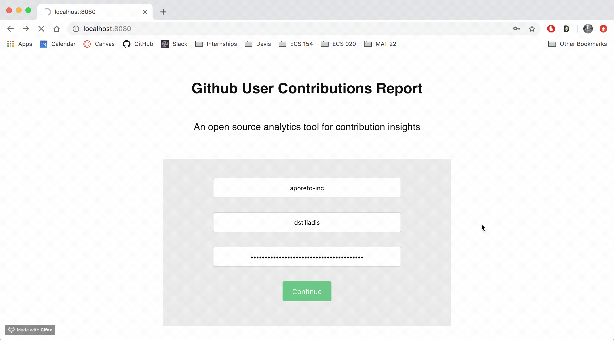

# Github User Contributions Report
Github User Contributions Report is an open-source analytics tool that generates reports on the contributions of a Github user to a Github organization. You can use github-orgs to monitor productivity and gain insights on contribution activity at your organization or company.  

## Demo
   {:height="50%" width="50%"}
   {:height="50%" width="50%"}

## Installation

## Usage

## Limitations
